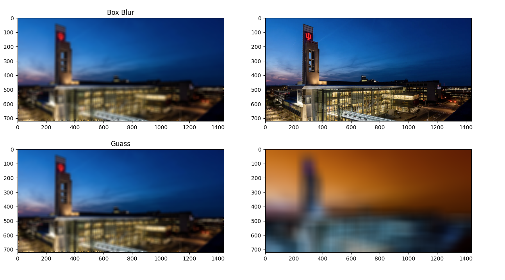

# Blur Project

### Nicholas Norman, May 2025

## Overview

This project uses pixel by pixel steps with a kernel matrix to be able to blur images using any set of weights. Currently, the only defined are uniform and guassian. Inspired by Captain Disolutions YouTube video about blur.

### Goal:

The goal was to move pixel by pixel and calculate the new pixel value (rgb) based on its surrounding pixels.

## Built with

- python 3.12
- openCV
- numpy
- matplotlib

## How to use

There are two files. The first is `openCV_crash_course.py`which is a template for how to use OpenCV with python. Disregard it. Second there is the main file `blur.py` that has an example to run.

To set up an image to use, do the following:
1. Put the image in the directory
2. Use `loadImage(image_path:str)` which returns two copies of the image `[img, img_orignial]`
3. Define the kernel. The two built-in functions are `createUniformKernel(rowSize:int,colSize:int)` and `gaussianKernel(size, sigma)`. Use these or define your own as size `(x,y,3)`. The last dimension represents the RGB (or BRG in opencv).
4. Process the image using `processImage(kernel, img, img_original)`. This changes img_original to a new image and keeps img the same.
5. Plot the images. To plot one image, use `showImage(img)` or define your own figure and subplots in matplotlib.

## Examples

Here are examples using this blur. The edges are not blurred as this has not been implemented yet. Also, the last image uses openCV's built-in blur for comparrison. Due to openCV using BRG, the colors are inverted. Pay no attention to it.

